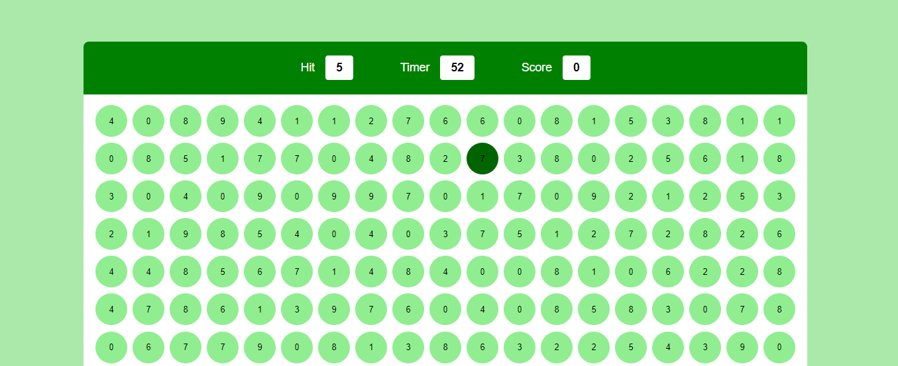

# Bubble game

Here's what you'll do:
🔹 Learn the ABCs of HTML, CSS, and JavaScript.
🔹 Make things pop with event bubbling.
🔹 Tweak your game using DOM tricks.
🔹 Create a complete game project that shows off your new skills.

# Result
 
 

